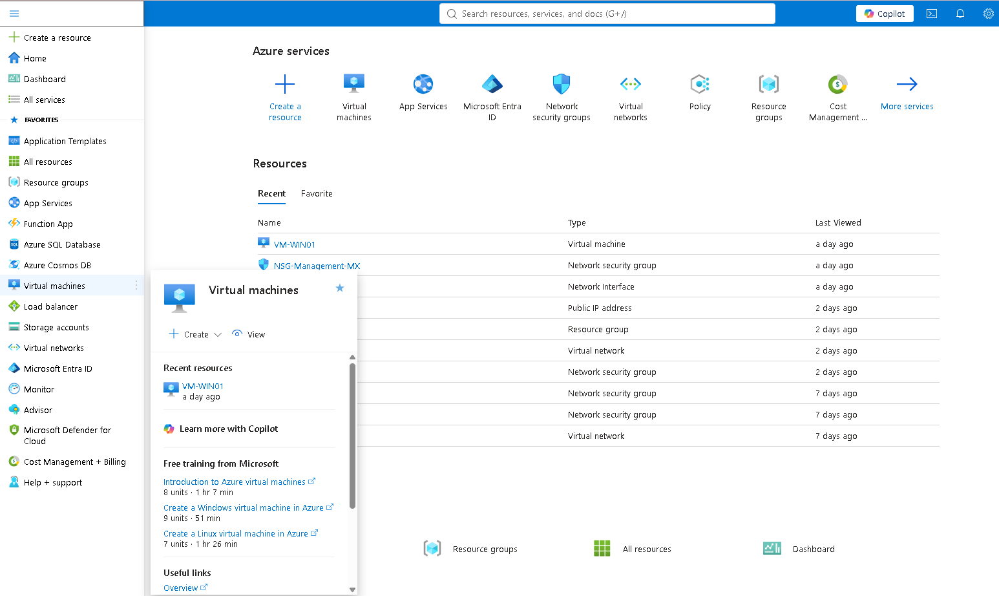
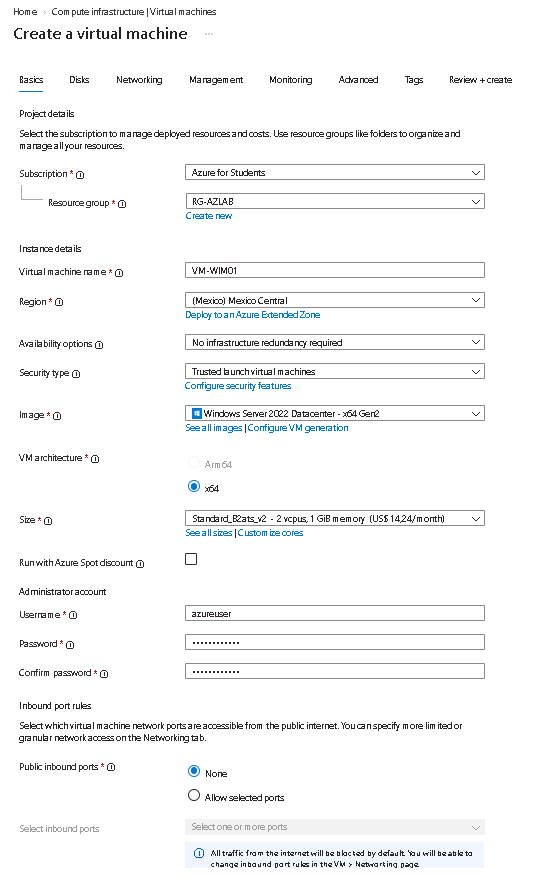
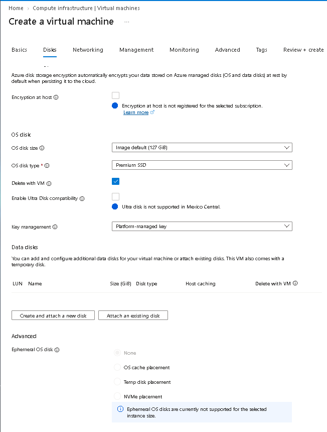
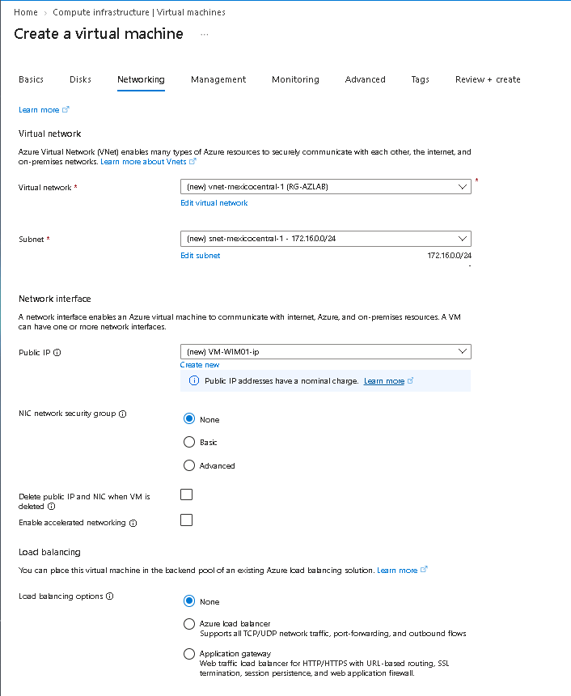
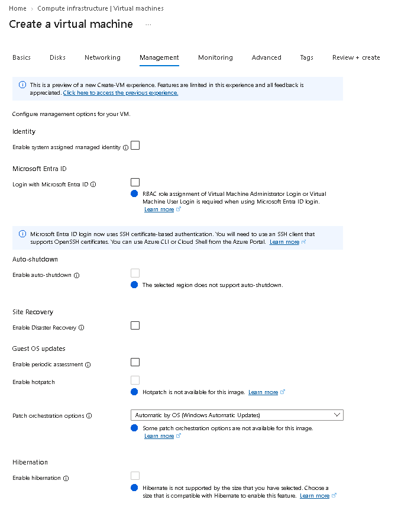
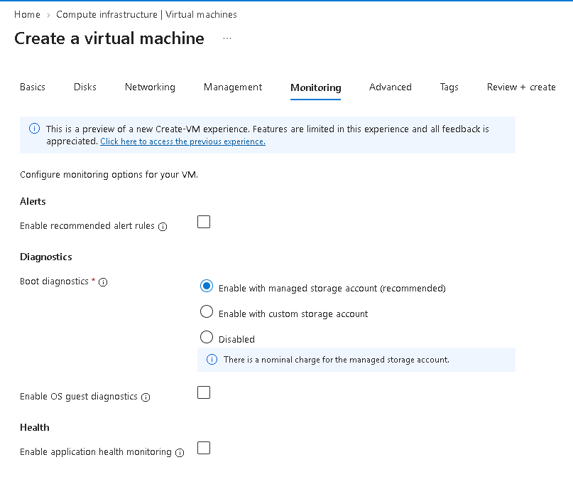
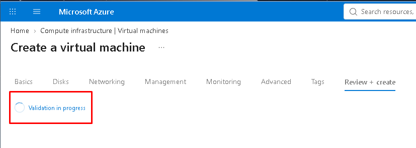
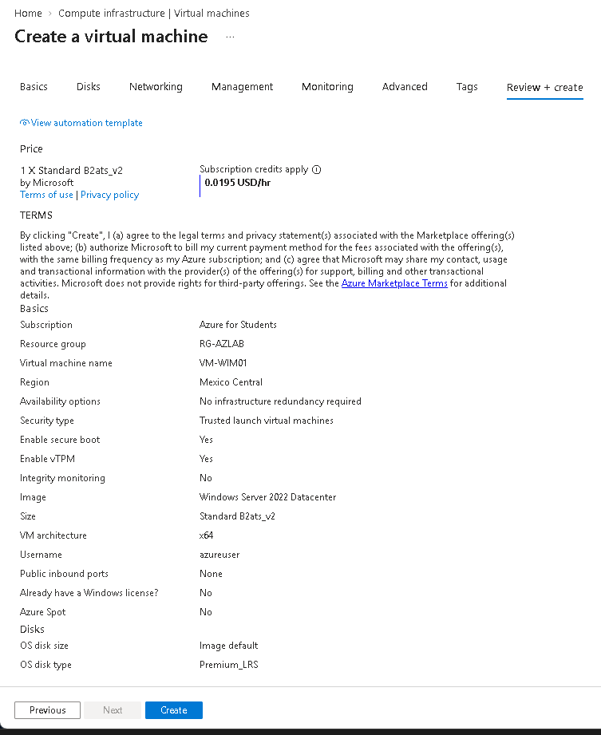
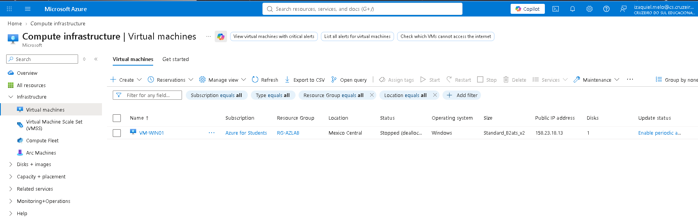

# :computer: Detalhes criação de uma VM - Azure

## 📌 Sobre o Projeto

Este projeto faz parte da **Formação Microsoft AZ-900 Certification** oferecido pela **DIO (Digital Innovation One)**, e tem como objetivo demonstrar, na prática, a execução e criação de um VM no Microsoft Azure.

Foram explorados três aplicações principais:

- :computer: **VM** (Máquina virtual com Windows Server 2022)
- :open_file_folder: **Armazenamento (Storage)** (Explorando os tipos e serviços)
- 🌐 **Região** (Valores e tipos)

---

## 🎯 Objetivos

- Configurações iniciais da VM
- Escolha da região (Zona) para provisionar a VM
- Alocação do disco para VM

---

## :computer: Ambiente Utilizado :computer:

| Componente | Descrição |
|---|---|
| **Sistema** | Windows Server 2022 |
| **Ambiente do lab** | Microsoft Azure |

---

## ⚙️ Configuração do Lab

### 🖥️ Virtual Machine (VM)

Para o laboratório foi utilizado o Portal Azure para criação de VM, Conectividade e outros recursos.

*Página inicial para criação de máquinas virtuais*

*Configuração inicial para criação de VM*

*Neste exemplo eu escolhi Premium SSD, mas se a sua VM não exigir muito desempenho, pode selecionar Standard Disk*

*Vnet criada antes da criação da VM e atribuída ao resource group AZLAB*

*Não precisa alterar nada*

*Manter o padrão*

*Aba Review+Create, validando todas as informações anteriores*

*Configurações vallidadas.

*VM Ligada e validada*

---

### 🔐 Informações importantes 

Etapas Principais no Portal Azure

1. Dados Básicos (Basics)

- Assinatura e Grupo de Recursos: Seleção da assinatura ativa e do Grupo de Recursos (Resource Group) para organização dos ativos.

- Nome e Região: Definição do nome da VM e da região geográfica do datacenter onde ela será hospedada.

- Imagem (SO): Escolha do Sistema Operacional (ex: Windows Server, Ubuntu, Red Hat).

- Tamanho (Size): Escolha da quantidade de vCPUs e memória RAM necessária para a carga de trabalho.

- Conta de Administrador: Configuração do usuário padrão e autenticação (chave SSH para Linux ou senha para Windows).

2. Discos (Disks)

- Disco do SO: Seleção do tipo de armazenamento para o sistema (SSD Premium, SSD Standard ou HDD Standard).

- Discos de Dados: Adição de discos rígidos virtuais adicionais para dados da aplicação, se necessário.

3. Rede (Networking)

- Rede Virtual (VNet) e Sub-rede: Vinculação da VM a uma rede privada virtual.

- IP Público: Definição de um endereço de IP público para acesso externo (opcional).

4. Gerenciamento e Avançado (Management & Advanced)

- Configuração de encerramento automático (para economizar custos), monitoramento de diagnósticos e políticas de backup.

5. Revisar e Criar (Review + Create)

- Validação final de todas as configurações e dos custos estimados por hora/mês. Clique em Criar para iniciar a implantação (deployment).

---

### ✔️ Resultado

Essas etapas levam a criação de uma VM no Microsoft Azure, com configurações básicas para uma VM de laboratório.

---

### ⚠️ Leia

> Este projeto foi elaborado **exclusivamente para fins educacionais** em ambiente controlado e isolado.
>
